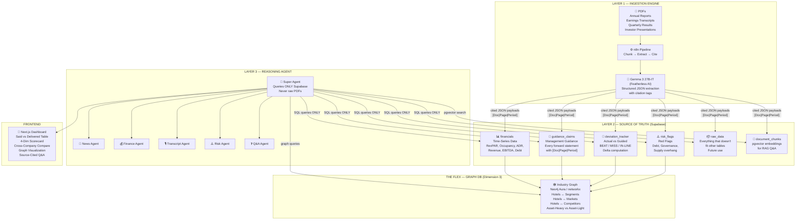

# PRD — EquityLens AI: Hotel Sector Intelligence System

**DataHack 2026 PS2 Agentic AI | Team of 4 | 22 Hours**
*Updated: 2026-04-11*

---

## 1. Executive Summary

EquityLens AI = an agentic system that catches hotel management lies with citations. it does what sell-side analysts do manually — extract every guidance statement, match it to actual results, and score management credibility — except it does it in seconds with every claim cited to `[Document | Page/Timestamp | Period]`.

**THE ONE RULE**: Every output cites its source. If data is not in ingested documents, the system says `DATA NOT AVAILABLE` — it never guesses. **The refusal to hallucinate is not a limitation. It is the entire product.**

**Sector**: Indian Hotels (5 companies)
**Architecture**: Urvi's 3-Layer Source-Only Architecture + Graph DB
**LLM**: Google Gemma 3 27B-IT on Featherless AI ($25/mo unlimited)
**Orchestration**: n8n (local via npm) — Super Agent + Sub-Agents

---

## 2. The 3-Layer Source-Only Architecture

> [!IMPORTANT]
> The AI **NEVER** reasons over raw PDFs at query time. It reasons ONLY over structured, cited facts in Supabase. This is architecturally guaranteed — not a prompt instruction.



### The Flow:
1. **Layer 1 (Ingestion)**: Raw PDFs go in → n8n chunks them → Gemma 3 27B-IT extracts every fact, stat, guidance statement → each data point tagged with `[Document | Page | Period]` → stored in appropriate Supabase table
2. **Layer 2 (Source of Truth)**: Supabase is the ONLY data store the reasoning agent can access. structured tables for financials, guidance, deviations, risks. anything that doesn't fit = `raw_data` table for future use
3. **Layer 3 (Reasoning)**: Super Agent orchestrates sub-agents. sub-agents query ONLY Supabase. never the raw PDFs. generates scorecards, comparisons, Q&A answers — all from cited structured data
4. **Graph DB**: Maps industry positioning — hotel chains, segments, markets, competitive collisions. visual flex for judges

---

## 3. Companies (From Urvi's Guide)

| Company | NSE | Segment | Why | Key Metrics |
|---|---|---|---|---|
| **IHCL (Taj)** | INDHOTEL | Premium/Luxury | Flagship brand, strongest pricing power, best disclosures, history of ambitious room additions that get delayed | RevPAR: ~₹8,500 · Occupancy: ~72% · ADR: ~₹11,800 |
| **Chalet Hotels** | CHALET | Upper Midscale/Business | Heavy Mumbai/Bengaluru exposure, business travel, detailed quarterly guidance | RevPAR: ~₹6,200 · Occupancy: ~70% · ADR: ~₹8,900 |
| **Lemon Tree** | LEMONTREE | Economy/Midscale | Different customer base, domestic business travellers, Tier 1+2 cities | RevPAR: ~₹2,800 · Occupancy: ~68% · ADR: ~₹4,100 |
| **EIH (Oberoi)** | EIHOTEL | Luxury | Family-run, Oberoi/Trident, good governance story | |
| **ITC Hotels** | ITCHOTELS | Premium Luxury | Recently demerged, sustainability narrative | |

> [!TIP]
> **THE DEMO EDGE (from Urvi)**: The contrast between Lemon Tree (economy) and IHCL (luxury) is the strongest demo moment — same RevPAR upcycle, very different unit economics and margins. Judges immediately understand the story without any finance background.

---

## 4. Urvi's 6 Checks — The Core Engine

> [!IMPORTANT]
> Every check produces cited output: `[Document | Page or Timestamp | Period]`. These are the specific verification rules our Transcript Agent implements.

### CHECK 1: RevPAR Guidance vs Actual
```
Extract verbatim RevPAR guidance from earnings call with timestamp.
Find actual RevPAR in Annual Report. Compute delta. Flag: BEAT / MISS / IN-LINE.

Example:
  Q2FY24 Call [12:41]: "We expect RevPAR to grow 15% in FY25."
  Actual FY25 AR [Page 87]: RevPAR growth = 9.2% | Delta: -5.8pp | FLAG: MISS
  Pattern: 3rd consecutive quarter of guidance miss
```

### CHECK 2: New Room Additions (Keys) — Guidance vs Actual
```
Hotel managements guide room count additions every year.
This is the MOST CONSISTENTLY OVER-GUIDED metric in Indian hotels.

Example:
  Q1FY24 Call: "We will add 2,000 keys by FY26."
  Actual FY26 AR [Page 34]: Keys added = 1,340 | Delta: -660 rooms
  FLAG: MISS | Pattern: delivery shortfall 3 years running
```

### CHECK 3: Occupancy vs ADR — Which Driver is Growing RevPAR?
```
Decompose RevPAR growth into occupancy contribution vs ADR contribution.
Flag if management's stated reason MISMATCHES actual data. Very common.

Example:
  Mgmt Q3FY24 [14:02]: "We are taking pricing across all properties."
  Actual: Occupancy up 8pp, ADR flat YoY [AR FY24, Page 91]
  FLAG: Occupancy-led, not ADR-led. Management claim MISMATCH.
```

### CHECK 4: F&B Revenue Share — Margin Warning Signal
```
F&B earns LOWER margins than rooms. If F&B share rising, EBITDA margins
compress even if RevPAR looks healthy. Track 4-year trend.

Example:
  F&B share: FY21: 28% | FY22: 30% | FY23: 33% | FY24: 36% [AR Revenue Note]
  EBITDA margin: FY21: 32% | FY24: 26% | Correlation confirmed.
  FLAG: Rising F&B mix compressing margins.
```

### CHECK 5: Debt and Interest Coverage
```
Hotels borrow heavily to build. Interest Coverage = EBITDA / Interest Expense.
Below 2x = danger zone. Track across 4 years.

Example:
  EBITDA FY24: Rs 800 Cr [AR FY24, P&L, Page 72]
  Interest FY24: Rs 450 Cr [AR FY24, Finance Costs, Page 73]
  Coverage: 1.78x | FLAG: CRITICAL — below 2x
  Mgmt Q4FY24 [11:22]: "Leverage is comfortable." > MISMATCH
```

### CHECK 6: New Supply in Key Markets — The Brownie Point
```
If company's AR says City X = 35% of revenue, flag if new supply being added
in that city. Managements stay QUIET about this. Catching it = analyst-grade.

Example:
  IHCL: Mumbai = 32% of revenue [AR FY24, Page 45]
  New 5-star keys under construction in Mumbai: 1,800 [Competitor DRHP, Page 88]
  FLAG: Significant supply overhang in key market
```

---

## 5. Tech Stack

| Layer | Technology | Cost | Why |
|---|---|---|---|
| **Orchestration** | n8n (local via npm) | Free | Visual multi-agent, Super Agent pattern, judges see DAG |
| **LLM** | **Google Gemma 3 27B-IT** on Featherless AI | $25/mo flat | Google model family, 27B, 32K context, unlimited calls, structured JSON |
| **LLM Backup** | Gemini 2.5 Flash (GCP) | $5 credits | Fallback if Gemma quality insufficient |
| **Source of Truth** | Supabase (PostgreSQL) | Free tier | Structured tables + pgvector. THE only source the agent queries |
| **Vector DB** | Supabase pgvector | Free (built-in) | Embeddings for RAG Q&A |
| **Graph DB** | Neo4j Aura (free cloud) OR networkx + vis.js | Free | Industry positioning visualization (Dimension 3) |
| **Frontend** | Next.js 14 + React | Free | Dark mode Bloomberg-style dashboard |
| **PDF Processing** | pdfplumber + PyPDF2 | Free | Text + table extraction |
| **Embeddings** | `all-MiniLM-L6-v2` (local) or Gemini text-embedding-004 | Free/cheap | Chunk embeddings for Q&A |
| **Hosting** | n8n local + Vercel (Next.js) | Free | Local n8n, free Vercel deploy |

### Google Gemma 3 27B-IT on Featherless AI
- **Model**: `google/gemma-3-27b-it` via `https://api.featherless.ai/v1` (OpenAI-compatible)
- **Cost**: $25/mo flat = UNLIMITED calls. no token anxiety
- **Usage**: ALL agents — extraction, scoring, risk analysis, Q&A, synthesis
- **Why Google**: same model family as our GCP story. 27B = strong reasoning + structured JSON

---

## 6. Layer 2 Schema — Supabase (Source of Truth)

> [!IMPORTANT]
> **CITATION RULE**: Every single row in every table has `source_document`, `source_page`, and `period` columns. No exceptions. If a data point cannot be cited, it does NOT get stored.

```sql
-- ============================================================
-- EQUITYLENS AI — SOURCE OF TRUTH SCHEMA
-- Every row is cited: [Document | Page | Period]
-- ============================================================

CREATE EXTENSION IF NOT EXISTS vector;

-- ═══════════════════════════════════════════════════════════
-- TABLE A: Time-Series Financials (Hotel-Specific Metrics)
-- ═══════════════════════════════════════════════════════════
-- Source: BSE quarterly results, Annual Reports, Screener.in
-- Tracks: RevPAR, ADR, Occupancy, Revenue, EBITDA, PAT, Debt,
--         Interest Coverage, ROCE, F&B share, Room count
CREATE TABLE financials (
  id UUID PRIMARY KEY DEFAULT gen_random_uuid(),
  company_id TEXT NOT NULL,
  period TEXT NOT NULL,              -- "Q1 FY24" or "FY24"
  period_type TEXT CHECK (period_type IN ('quarterly', 'annual')),
  metric TEXT NOT NULL,              -- revpar | adr | occupancy | revenue | ebitda |
                                     -- pat | debt | interest_coverage | roce |
                                     -- fnb_share | room_count | arr | capex |
                                     -- fnb_revenue | room_revenue | other_revenue
  value FLOAT,
  unit TEXT,                         -- INR Cr | % | INR | rooms | x (for ratios)
  yoy_change FLOAT,                 -- year-over-year change %
  source_document TEXT NOT NULL,     -- "IHCL_AR_FY24.pdf"
  source_page INT,                   -- page number
  source_timestamp TEXT,             -- for earnings calls "12:41"
  period_label TEXT,                 -- "FY24" or "Q2 FY24"
  created_at TIMESTAMPTZ DEFAULT NOW()
);

CREATE INDEX idx_fin_company ON financials(company_id);
CREATE INDEX idx_fin_period ON financials(period);
CREATE INDEX idx_fin_metric ON financials(metric);

-- ═══════════════════════════════════════════════════════════
-- TABLE B: Management Guidance Claims
-- ═══════════════════════════════════════════════════════════
-- Source: Earnings call transcripts ONLY
-- Every forward-looking quantitative statement with exact citation
CREATE TABLE guidance_claims (
  id UUID PRIMARY KEY DEFAULT gen_random_uuid(),
  company_id TEXT NOT NULL,
  statement_quarter TEXT,            -- quarter the statement was made in: "Q2 FY24"
  statement_date DATE,
  target_period TEXT,                -- "FY25" or "Q3 FY24" — what period guidance refers to
  metric_type TEXT NOT NULL,         -- revpar | adr | occupancy | rooms_keys | revenue |
                                     -- ebitda_margin | capex | fnb_revenue | properties
  guidance_value_low FLOAT,          -- range low (12 in "12-15%")
  guidance_value_high FLOAT,         -- range high (15 in "12-15%")
  guidance_value_point FLOAT,        -- point estimate if not a range
  unit TEXT,                         -- % | INR Cr | rooms | INR | bps
  verbatim_quote TEXT NOT NULL,      -- EXACT words from transcript
  confidence_language TEXT,          -- will | expect | targeting | plan | hope
  speaker TEXT,                      -- CEO | CFO | COO | MD
  check_type TEXT,                   -- maps to Urvi's checks: check_1_revpar | check_2_keys |
                                     -- check_3_driver | check_4_fnb | check_5_debt | check_6_supply
  source_document TEXT NOT NULL,     -- "IHCL_Q2FY24_transcript.pdf"
  source_page INT,
  source_timestamp TEXT,             -- "12:41" — timestamp in earnings call
  extracted_at TIMESTAMPTZ DEFAULT NOW(),
  verified BOOLEAN DEFAULT FALSE
);

CREATE INDEX idx_guid_company ON guidance_claims(company_id);
CREATE INDEX idx_guid_check ON guidance_claims(check_type);

-- ═══════════════════════════════════════════════════════════
-- TABLE C: Actual vs Guided (Deviation Tracker)
-- ═══════════════════════════════════════════════════════════
-- The "Said vs Delivered" table — THE core output
CREATE TABLE deviation_tracker (
  id UUID PRIMARY KEY DEFAULT gen_random_uuid(),
  guidance_id UUID REFERENCES guidance_claims(id),
  actual_metric_id UUID REFERENCES financials(id),
  company_id TEXT NOT NULL,
  period TEXT NOT NULL,               -- the period being compared
  metric_type TEXT NOT NULL,
  check_type TEXT,                    -- which of Urvi's 6 checks this falls under
  guided_value FLOAT,                -- what management said
  actual_value FLOAT,                -- what actually happened
  delta FLOAT,                       -- absolute difference
  delta_pct FLOAT,                   -- percentage difference
  flag TEXT CHECK (flag IN ('BEAT', 'MISS', 'IN-LINE')),
  severity TEXT CHECK (severity IN ('none', 'minor', 'moderate', 'major', 'critical')),
  pattern TEXT,                       -- "3rd consecutive miss on RevPAR"
  insight TEXT,                       -- AI-generated one-liner insight
  source_guidance TEXT NOT NULL,      -- "[Q2FY24 Call | 12:41]"
  source_actual TEXT NOT NULL,        -- "[AR FY24 | Page 87]"
  created_at TIMESTAMPTZ DEFAULT NOW()
);

CREATE INDEX idx_dev_company ON deviation_tracker(company_id);
CREATE INDEX idx_dev_flag ON deviation_tracker(flag);

-- ═══════════════════════════════════════════════════════════
-- TABLE D: Risk Flags
-- ═══════════════════════════════════════════════════════════
CREATE TABLE risk_flags (
  id UUID PRIMARY KEY DEFAULT gen_random_uuid(),
  company_id TEXT NOT NULL,
  category TEXT CHECK (category IN (
    'debt', 'governance', 'operational', 'regulatory',
    'auditor', 'supply_overhang', 'margin_compression',
    'management_mismatch', 'key_person'
  )),
  check_type TEXT,                    -- links to Urvi's check if applicable
  description TEXT NOT NULL,
  severity TEXT CHECK (severity IN ('critical', 'high', 'medium')),
  verbatim_quote TEXT,                -- exact text from document if applicable
  source_document TEXT NOT NULL,
  source_page INT,
  period TEXT,
  created_at TIMESTAMPTZ DEFAULT NOW()
);

-- ═══════════════════════════════════════════════════════════
-- TABLE E: Raw Data (catch-all for unclassified extractions)
-- ═══════════════════════════════════════════════════════════
-- If extracted data doesn't fit tables A-D, store here for future use
CREATE TABLE raw_data (
  id UUID PRIMARY KEY DEFAULT gen_random_uuid(),
  company_id TEXT NOT NULL,
  data_type TEXT,                     -- qualitative | quantitative | strategic | other
  category TEXT,                      -- what topic: expansion | brand | management | market
  key_name TEXT,                      -- e.g. "brand_strategy" or "geographic_expansion_plan"
  value_text TEXT,                    -- the extracted content
  value_numeric FLOAT,               -- if it has a number
  unit TEXT,
  context TEXT,                       -- surrounding text for meaning
  source_document TEXT NOT NULL,
  source_page INT,
  source_timestamp TEXT,
  period TEXT,
  created_at TIMESTAMPTZ DEFAULT NOW()
);

CREATE INDEX idx_raw_company ON raw_data(company_id);
CREATE INDEX idx_raw_type ON raw_data(data_type);

-- ═══════════════════════════════════════════════════════════
-- TABLE F: Credibility Scores (computed from deviation_tracker)
-- ═══════════════════════════════════════════════════════════
CREATE TABLE credibility_scores (
  id UUID PRIMARY KEY DEFAULT gen_random_uuid(),
  company_id TEXT NOT NULL,
  period TEXT NOT NULL,
  overall_score FLOAT,                -- 0-100
  check_1_revpar_score FLOAT,        -- per-check scores
  check_2_keys_score FLOAT,
  check_3_driver_score FLOAT,
  check_4_fnb_score FLOAT,
  check_5_debt_score FLOAT,
  check_6_supply_score FLOAT,
  hit_rate FLOAT,                     -- % of guidance within ±5% of actual
  avg_deviation FLOAT,
  total_guidance_count INT,
  total_matched_count INT,
  consecutive_misses INT,             -- red flag if ≥3
  trend TEXT CHECK (trend IN ('improving', 'stable', 'declining')),
  created_at TIMESTAMPTZ DEFAULT NOW(),
  UNIQUE(company_id, period)
);

-- ═══════════════════════════════════════════════════════════
-- TABLE G: 4-Dimension Scorecards
-- ═══════════════════════════════════════════════════════════
CREATE TABLE scorecards (
  id UUID PRIMARY KEY DEFAULT gen_random_uuid(),
  company_id TEXT NOT NULL,
  period TEXT NOT NULL,
  dim_credibility FLOAT,              -- from credibility_scores
  dim_financial_quality FLOAT,        -- RevPAR trend, margin, cash, ROCE
  dim_industry_position FLOAT,        -- from graph + financial ranking
  dim_risk FLOAT,                     -- inverse of risk_flags severity
  composite_score FLOAT,
  confidence_level TEXT,              -- high | medium | low (based on data completeness)
  evidence_summary JSONB,            -- JSON with citations for each dimension
  created_at TIMESTAMPTZ DEFAULT NOW(),
  UNIQUE(company_id, period)
);

-- ═══════════════════════════════════════════════════════════
-- TABLE H: Document Chunks + pgvector Embeddings (for RAG)
-- ═══════════════════════════════════════════════════════════
CREATE TABLE document_chunks (
  id UUID PRIMARY KEY DEFAULT gen_random_uuid(),
  company_id TEXT NOT NULL,
  document_type TEXT CHECK (document_type IN (
    'transcript', 'annual_report', 'quarterly_results', 'investor_presentation'
  )),
  period TEXT,
  chunk_text TEXT NOT NULL,
  chunk_index INT,
  source_document TEXT NOT NULL,
  source_page INT,
  speaker TEXT,                       -- for transcripts: CEO,CFO, Analyst name
  embedding vector(768),
  created_at TIMESTAMPTZ DEFAULT NOW()
);

CREATE INDEX ON document_chunks
  USING ivfflat (embedding vector_cosine_ops) WITH (lists = 100);

-- ═══════════════════════════════════════════════════════════
-- Companies master table
-- ═══════════════════════════════════════════════════════════
CREATE TABLE companies (
  id TEXT PRIMARY KEY,
  name TEXT NOT NULL,
  ticker_nse TEXT,
  segment TEXT,                       -- premium_luxury | upper_midscale | economy_midscale
  strategy TEXT,                      -- asset_heavy | asset_light | hybrid
  brands TEXT[],
  key_markets TEXT[],                 -- cities with highest revenue share
  created_at TIMESTAMPTZ DEFAULT NOW()
);

INSERT INTO companies VALUES
  ('IHCL', 'Indian Hotels Company Ltd', 'INDHOTEL', 'premium_luxury', 'hybrid',
   ARRAY['Taj', 'Vivanta', 'SeleQtions', 'Ginger'],
   ARRAY['Mumbai', 'Delhi', 'Bengaluru', 'Goa']),
  ('CHALET', 'Chalet Hotels Ltd', 'CHALET', 'upper_midscale', 'asset_heavy',
   ARRAY['Marriott', 'Westin', 'Renaissance', 'Four Points'],
   ARRAY['Mumbai', 'Bengaluru', 'Hyderabad']),
  ('LEMONTREE', 'Lemon Tree Hotels Ltd', 'LEMONTREE', 'economy_midscale', 'hybrid',
   ARRAY['Lemon Tree Premier', 'Lemon Tree', 'Red Fox', 'Keys'],
   ARRAY['Delhi-NCR', 'Hyderabad', 'Pune', 'Bengaluru']),
  ('EIH', 'EIH Ltd (Oberoi Group)', 'EIHOTEL', 'premium_luxury', 'asset_heavy',
   ARRAY['Oberoi', 'Trident'],
   ARRAY['Delhi', 'Mumbai', 'Udaipur', 'Agra']),
  ('ITCHOTELS', 'ITC Hotels Ltd', 'ITCHOTELS', 'premium_luxury', 'asset_heavy',
   ARRAY['ITC Grand', 'Welcomhotel', 'Mementos', 'Storii'],
   ARRAY['Delhi', 'Bengaluru', 'Chennai', 'Kolkata']);

-- pgvector similarity search function
CREATE OR REPLACE FUNCTION match_documents(
  query_embedding vector(768),
  match_count INT DEFAULT 5,
  filter_company TEXT DEFAULT NULL
)
RETURNS TABLE (
  id UUID, company_id TEXT, document_type TEXT, period TEXT,
  chunk_text TEXT, source_document TEXT, source_page INT,
  speaker TEXT, similarity FLOAT
)
LANGUAGE plpgsql AS $$
BEGIN
  RETURN QUERY
  SELECT dc.id, dc.company_id, dc.document_type, dc.period,
    dc.chunk_text, dc.source_document, dc.source_page, dc.speaker,
    1 - (dc.embedding <=> query_embedding) AS similarity
  FROM document_chunks dc
  WHERE (filter_company IS NULL OR dc.company_id = filter_company)
  ORDER BY dc.embedding <=> query_embedding
  LIMIT match_count;
END; $$;
```

---

## 7. The Graph DB — Dimension 3: Industry Positioning

> [!TIP]
> **THE FLEX**: While other teams use flat tables, we have a graph that visually shows competitive collisions. Judges can SEE which hotels compete for the same segments in the same cities.

### Graph Structure (Neo4j Aura free tier or networkx + vis.js):

**Nodes:**
| Type | Examples |
|---|---|
| `Hotel Company` | IHCL, Chalet Hotels, Lemon Tree, EIH, ITC Hotels |
| `Segment` | Luxury, Premium, Upper Midscale, Midscale, Economy |
| `Market (City)` | Mumbai, Delhi, Bengaluru, Hyderabad, Goa, Jaipur |
| `Strategy` | Asset-Heavy, Asset-Light (Management Contracts), Hybrid |
| `Macro Theme` | Tourism Boom, Infrastructure Push, MICE Growth, Tier-2 Expansion |
| `Key Person` | N Chandrasekaran (Tata/IHCL), PRS Oberoi (EIH), Patanjali Keswani (Lemon Tree) |

**Edges (Relationships):**
```
[IHCL] --OPERATES_IN--> [Mumbai] {revenue_share: 32%, source: "AR FY24, Page 45"}
[IHCL] --FOCUSES_ON--> [Luxury Segment]
[IHCL] --COMPETES_WITH--> [EIH] {in: "Luxury", markets: ["Mumbai","Delhi"]}
[Chalet] --OPERATES_IN--> [Mumbai] {revenue_share: 45%}
[Chalet] --USES_BRAND--> [Marriott] {relationship: "management_contract"}
[Lemon Tree] --FOCUSES_ON--> [Economy Segment]
[Lemon Tree] --EXPANDING_TO--> [Tier 2 Cities]
[IHCL] --STRATEGY--> [Hybrid] {asset_heavy: "Taj", asset_light: "Ginger"}
```

**Competitive collision example:**
```
If IHCL and Chalet both --OPERATES_IN--> [Mumbai] with combined 45%+ revenue share,
AND new supply of 1,800 keys coming in Mumbai (from Hotelivate data),
THEN both face supply overhang risk → Graph visually highlights this collision
```

### How to build cheaply in 22 hours:
- **Option A**: Neo4j Aura free tier → Cypher queries → vis.js frontend visualization
- **Option B**: Python networkx → compute graph metrics → export JSON → vis.js/Three.js in Next.js
- Option B is faster to build. graph data comes from Supabase (companies table + financials).

---

## 8. Multi-Agent Design — Super Agent + Sub-Agents

### The Agent Roster

| Agent | Role | LLM | Data Source | Output |
|---|---|---|---|---|
| 🧠 **Super Agent** | Orchestrator | Gemma 3 27B-IT | queries Supabase ONLY | delegates to sub-agents, synthesizes scorecards |
| 📰 **News Agent** | News & Sentiment | Gemma 3 27B-IT | NewsAPI / RSS | sentiment score, industry trends |
| 💰 **Finance Agent** | Financial Data | Code only (no LLM) | parses BSE results | populates `financials` table |
| 🎙️ **Transcript Agent** | Guidance & Credibility | Gemma 3 27B-IT | parses earnings transcripts | populates `guidance_claims`, runs 6 checks, computes credibility |
| ⚠️ **Risk Agent** | Risk Analysis | Gemma 3 27B-IT | scans AR notes, auditor reports | populates `risk_flags` |
| ❓ **Q&A Agent** | Analyst Q&A | Gemma 3 27B-IT | pgvector search on Supabase | source-cited answers, refusal when unsourced |

### n8n Workflow Structure

```
WORKFLOW 0: SUPER AGENT (main — webhook trigger)
  [Webhook Trigger] → [AI Agent node w/ Gemma 3 27B-IT]
    System: "You orchestrate equity research. Query ONLY Supabase.
    Never access raw PDFs. Every output must cite [Doc|Page|Period].
    If data not available, say DATA NOT AVAILABLE."
    
    Tools:
      → [Execute Sub-Workflow] call_transcript_agent
      → [Execute Sub-Workflow] call_finance_agent
      → [Execute Sub-Workflow] call_news_agent
      → [Execute Sub-Workflow] call_risk_agent
      → [Execute Sub-Workflow] call_qa_agent
      → [Supabase Tool] query structured data
  → [Respond to Webhook]

WORKFLOW 1: INGESTION PIPELINE (runs once per document — Layer 1)
  [Manual Trigger] → [Code: PDF extract + chunk] → [Loop over chunks]
    → [Gemma 3 27B-IT: extract facts + classify table]
    → [Code: Route to correct Supabase table]
      → IF financials metric → INSERT financials
      → IF guidance statement → INSERT guidance_claims
      → IF risk flag → INSERT risk_flags
      → ELSE → INSERT raw_data
    → [Code: Generate embedding] → INSERT document_chunks

WORKFLOW 2: Transcript Agent (sub-workflow — runs 6 checks)
  [Sub-WF Trigger] → extract guidance → compute deviations → credibility score

WORKFLOW 3: Finance Agent (sub-workflow)
  [Sub-WF Trigger] → parse BSE Excel → normalize → INSERT financials

WORKFLOW 4: News Agent (sub-workflow)
  [Sub-WF Trigger] → NewsAPI → Gemma sentiment → return

WORKFLOW 5: Risk Agent (sub-workflow)
  [Sub-WF Trigger] → extract AR sections → Gemma risk scan → INSERT risk_flags

WORKFLOW 6: Q&A Agent (sub-workflow)
  [Sub-WF Trigger] → embed query → pgvector → Gemma answer w/ citations
```

### The Ingestion Flow (Layer 1 detail):

```python
# Pseudocode for what Gemma 3 27B-IT does per chunk:

INPUT: transcript_chunk + metadata {company, quarter, page, speaker}

PROMPT: """
Extract ALL facts and statistics from this hotel company document chunk.
For EACH extracted item, classify it into one of these categories:

1. FINANCIAL_METRIC: any quantitative metric (RevPAR, ADR, occupancy, 
   revenue, EBITDA, PAT, debt, rooms, F&B share, etc.)
   → goes to `financials` table

2. GUIDANCE_CLAIM: any FORWARD-LOOKING statement about future performance
   → goes to `guidance_claims` table
   
3. RISK_FLAG: any risk, red flag, auditor remark, governance concern
   → goes to `risk_flags` table

4. RAW_DATA: anything else factual but not fitting above
   → goes to `raw_data` table (brand strategy, market commentary, etc.)

EVERY item MUST include:
- source_document: "{filename}"
- source_page: {page_number}
- source_timestamp: "{timestamp if earnings call}"
- period: "{FY24 or Q2 FY24}"

Return JSON array with classification + data.
"""

OUTPUT: [
  {table: "financials", data: {metric: "revpar", value: 8500, ...}},
  {table: "guidance_claims", data: {metric_type: "rooms_keys", ...}},
  {table: "raw_data", data: {key: "brand_strategy", value_text: "..."}},
]
```

---

## 9. The Four Dimensions

| Dim | Weight | What | Data Source |
|---|---|---|---|
| 🎯 **Credibility** | 40% | Said vs Delivered — Urvi's 6 checks, hit rate, consecutive misses | `guidance_claims` + `deviation_tracker` + `credibility_scores` |
| 💰 **Financial Quality** | 25% | RevPAR trend, margin stability, cash conversion, ROCE, debt health | `financials` table |
| 🕸️ **Industry Position** | 20% | Segment positioning, market share, competitive collisions, asset strategy | Graph DB + `financials` + `companies` |
| ⚠️ **Risk** | 15% | Debt, governance, supply overhang, margin compression, mgmt mismatch | `risk_flags` table |

### Credibility Score Formula:
```python
score = (
    hit_rate * 0.35 +             # % guidance within ±5% of actual
    (1 - avg_deviation) * 0.25 +  # inverse of avg miss magnitude
    consistency * 0.20 +          # inverse of std_dev(deviations)
    driver_honesty * 0.10 +       # Check 3: do they claim correct RevPAR driver?
    guidance_freq_bonus * 0.10    # more guidance = more confidence in score
) * 100
```

---

## 10. Data Sources

| Source | Data | Priority |
|---|---|---|
| **BSE India** (bseindia.com) | Quarterly results, annual reports | 🔴 Critical |
| **Company IR Pages** | Earnings transcripts, investor presentations | 🔴 Critical |
| **Screener.in** | 10yr structured financials, ratios | 🔴 Critical |
| **Hotelivate T&O Report** (TO-Oct2025.pdf) | Industry benchmarks — RevPAR, ADR, occupancy by city, supply pipeline | 🟡 Check 6 data |
| **Trendlyne** | Backup transcripts, analyst estimates | 🟡 Backup |
| **Competitor DRHPs** (BSE filings) | New supply data for Check 6 | 🟡 Brownie |

### Pre-Downloaded Data Structure:
```
data/
├── IHCL/
│   ├── IHCL_Q1FY24_transcript.pdf
│   ├── IHCL_Q2FY24_transcript.pdf
│   ├── IHCL_Q3FY24_transcript.pdf
│   ├── IHCL_Q4FY24_transcript.pdf
│   ├── IHCL_FY24_AR.pdf
│   └── IHCL_FY24_results.xlsx
├── CHALET/
│   └── ... (same structure)
├── LEMONTREE/
│   └── ...
├── EIH/
│   └── ...
├── ITCHOTELS/
│   └── ...
└── industry/
    └── TO-Oct2025.pdf    ← Hotelivate report for Check 6
```

---

## 11. 22-Hour Build Plan

### Team Roles:
| Person | Role | Primary |
|---|---|---|
| **P1** | Data + Infra | Supabase, n8n, data pipeline, Graph DB |
| **P2** | AI/NLP | Gemma prompts, 6 checks implementation, extraction quality |
| **P3** | Quant | Scoring formulas, deviation logic, comparison engine |
| **P4** | Frontend | Next.js dashboard, graph visualization, demo flow |

### Hour-by-Hour:
```
PHASE 1: FOUNDATION (Hours 0-3) ─────────────────────────────

P1: Supabase project → run full schema SQL → pgvector extension
P1: n8n local setup (npm install n8n -g, n8n start)
P2: Featherless API test (google/gemma-3-27b-it), test JSON extraction
P2: Test CHECK 1 (RevPAR) on 1 sample IHCL transcript
P3: Define credibility formula, document scoring logic
P3: Download + organize all data (transcripts + results)
P4: Next.js scaffold, dark mode, tab structure (Tracker|Scorecard|Compare|Q&A|Graph)
P4: Supabase client setup, API routes

⏰ H3: supabase tables exist, n8n running, 1 transcript extracted, Next.js scaffold live

PHASE 2: LAYER 1 — INGESTION (Hours 3-8) ────────────────────

P1: Build n8n Workflow 1 — Ingestion Pipeline
    PDF → chunk → Gemma extract → classify → route to correct table
P1: Add raw_data catch-all routing for unclassified extractions
P2: Build extraction prompt for all 6 checks in Transcript Agent
P2: Run extraction on ALL transcripts → guidance_claims populated
P3: Parse BSE quarterly results → financials table populated
P3: Manual verification of 10% extracted guidance (quality gate)
P4: Build Said vs Delivered table UI (THE demo moment)
P4: Build company selector sidebar

⏰ H8: guidance_claims + financials populated for 3+ companies
   "Said vs Delivered" table shows real data for IHCL

PHASE 3: LAYER 3 — REASONING (Hours 8-12) ───────────────────

P1: Build Super Agent workflow (Workflow 0) with sub-workflow tools
P1: Build deviation computation (JOIN guidance + actuals → deviation_tracker)
P2: Build Risk Agent → risk_flags populated
P2: Quality-check extractions, fix edge cases for all 6 checks
P3: Compute credibility scores for all companies
P3: Build cross-company comparison ranking
P4: Build Scorecard UI — 4-dim spider chart + per-check breakdown
P4: Build Comparison UI — ranked table

⏰ H12: all 6 checks running, scores computed, UI shows real data

PHASE 4: Q&A + GRAPH (Hours 12-16) ──────────────────────────

P1: Build Q&A Agent (pgvector retrieval → Gemma cited answers)
P1: Embed all chunks → pgvector
P2: Q&A system prompt (cite or refuse, never guess)
P2: Wire News Agent sub-workflow
P3: Build Graph DB — networkx graph from companies/financials data
P3: Add Graph-based industry positioning to scorecard
P4: Build Q&A UI — input + answer + citations panel
P4: Build Graph visualization (vis.js or similar in Next.js)

⏰ H16: Q&A works w/ citations, Graph shows competitive map

PHASE 5: POLISH + DEMO PREP (Hours 16-20) ──────────────────

P1: n8n workflow polish — execution logs, error handling
P2: Red Flags panel (consecutive misses, CHECK 4 F&B warnings)
P3: Validate all scores manually for IHCL + Lemon Tree
P3: Investor Matcher (if ahead — Buffett/RJ lens)
P4: UI animations, dark mode refinement, loading states
P4: Timeline chart (credibility score Q1→Q4)
ALL: End-to-end test × 3

⏰ H20: demo flow works 3× clean

PHASE 6: SHIP (Hours 20-22) ─────────────────────────────────

ALL: Demo rehearsal × 3 (must fit 5 minutes)
P1: README, architecture diagram, setup instructions
P4: Record backup demo video
ALL: Submit
```

---

## 12. Feature Cutoff Decision Tree

```
Hour 8: Is Layer 1 (Ingestion) + Layer 2 (Supabase) populated?
├─ YES → proceed to Layer 3 reasoning + scoring
│   └─ Hour 12: Are 6 checks + deviation tracker + scorecard working?
│       ├─ YES → proceed to Q&A + Graph DB
│       │   └─ Hour 16: Q&A + Graph done?
│       │       ├─ YES → Investor Matcher + polish
│       │       └─ NO → polish existing, skip Investor Matcher
│       └─ NO → cut Q&A + Graph, nail Tracker + Scorecard + Compare
└─ NO → STOP. fix pipeline. cut to 3 companies. nail IHCL + Lemon Tree
```

---

## 13. Demo Script (5 Minutes)

| Time | What | Script | Why It Wins |
|---|---|---|---|
| 0:00-0:30 | **Architecture** | Show n8n Super Agent → sub-workflows. "3 layers. Layer 1 ingests. Layer 2 is the only source of truth. Layer 3 reasons only over cited structured data. Hallucination is architecturally impossible." | trust + sophistication |
| 0:30-1:30 | **Live Ingestion** | Drop IHCL transcript PDF. Show data flowing: chunk → extract → cite → route to table. "Every data point tagged [Document \| Page \| Period]. Nothing enters without a citation." | source-only proof |
| 1:30-2:30 | **Said vs Delivered** | Show THE table. Point to IHCL RevPAR miss: "Q2FY24 Call [12:41] — MD guided RevPAR growth of 15%. Actual [AR FY24, Page 87]: 9.2%. Delta: -5.8pp. MISS. Third consecutive quarter. This is what analysts do manually. We do it in seconds." | THE wow moment |
| 2:30-3:15 | **Scorecard** | 4-dim spider chart. Click any score → see citation chain. Show Check 3 driver analysis: "Management said ADR-led. Data says occupancy-led. MISMATCH flagged." | depth on depth |
| 3:15-3:45 | **Cross-Company** | Compare IHCL vs Lemon Tree. "Same upcycle. IHCL RevPAR ₹8,500 vs Lemon Tree ₹2,800. But Lemon Tree has 78 credibility vs IHCL's 71." Show Graph: competitive collision in Mumbai. | counter-narrative |
| 3:45-4:15 | **The Refusal** | Ask about data NOT in documents. System: "DATA NOT AVAILABLE. Required: Q4 FY25 results for IHCL." "The refusal is the product." | hardest to build |
| 4:15-5:00 | **Brownie** | Graph DB visualization — hover shows edges. Check 6 supply overhang flag. Red flags panel. "Zero tolerance for unsourced claims." | visual + analytical depth |

---

## 14. Open Questions

> [!IMPORTANT]
> Decisions needed:

1. **Graph DB**: Neo4j Aura (free cloud, proper graph queries) or networkx + vis.js (faster to build, all Python)?
2. **Embedding model**: local `all-MiniLM-L6-v2` (free) or Gemini `text-embedding-004` (GCP credits)?
3. **Companies**: 5 (IHCL, Chalet, Lemon Tree, EIH, ITC Hotels) or 3 (IHCL, Chalet, Lemon Tree) for depth?
4. **Who downloads data RIGHT NOW?** Assign 1 person immediately.
5. **Check 6 data source**: use Hotelivate T&O report (we have it) for supply pipeline data?
